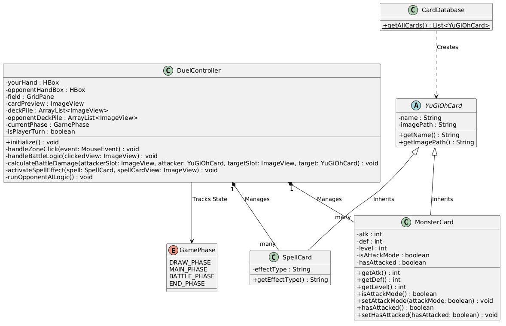
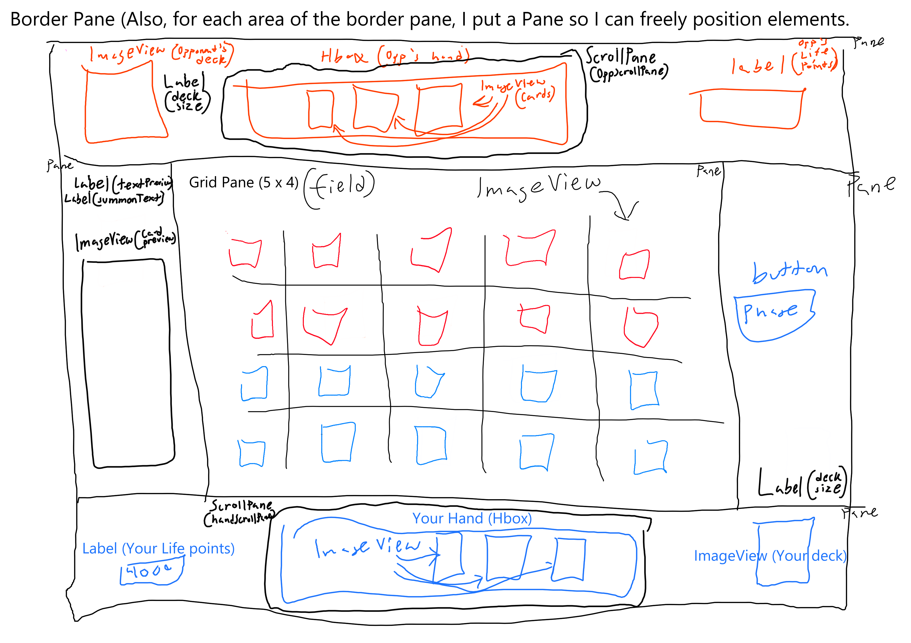

# Final Project GUI
My final project is going to be Yu Gi Oh!
Use [Markdown](https://www.markdownguide.org/basic-syntax) to format appropriately.
## Final Project Description
_Pretty much Yu-Gi-Oh!_

## GUI Wireframe
_Embed your wireframe image(s) here! Here is an example_

Video is encouraged but not neccessary.
Add UML here

JavaDoc

